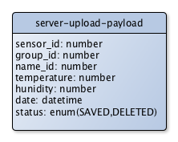
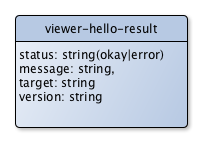
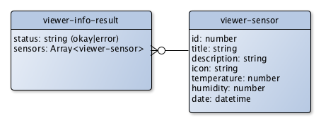
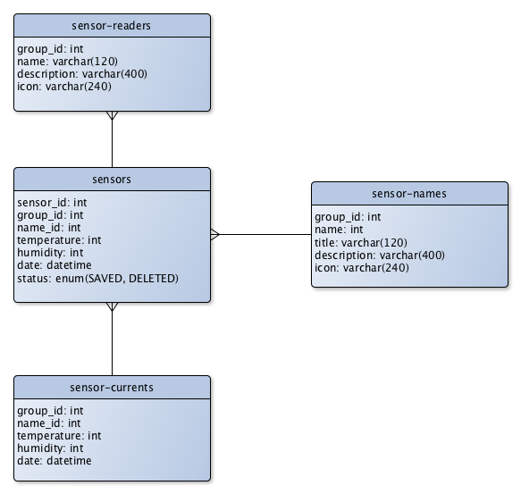

Temperature Sensor Server
=========================

> This is the rest server, written in PHP with the slim framework, collecting the sensor data.


Table of Content
----------------

* [Usage the Endpoints](#user-content-usage-the-endpoints)
    * [Server Endpoints](#user-content-server-endpoints)
    * [Viewer Endpoints](#user-content-viewer-endpoints)
* [Database Schema](#user-content-database-schema)
* [License](#user-content-license)


Usage the Endpoints
-------------------

The application is separated in different parts

* The `server` part has the functionality to receive sensor data and stores into the database
* The `viewer` part has the functionality to delivery information about the temperature and humidity.

### Server Endpoints

| Name                | Values
|---------------------|--------------------------------------------------
| **Endpoint**        | `/server/hello`
| Method              | `GET`
| Result              | 
| Description         | The endpoint shows the version information about the temperature sensor service.
|                     |
| **Endpoint**        | `/server/upload`
| Method              | `POST`
| PayLoad             | 
| Result              | 
| Description         | The enpoint receive the sensor data and insert into the database and returns the id of sensor record
|                     |


### Viewer Endpoints

| Name                | Values
|---------------------|--------------------------------------------------
| **Endpoint**        | `/viewer/hello`
| Method              | `GET`
| Result              | 
| Description         | The endpoint shows the version information about the temperature sensor viewer.
|                     |
| **Endpoint**        | `/viewer/info`
| Method              | `GET`
| Result              | 


Database Schema
---------------

The sensor server application needs some MySQL database tables. Here is the database schema




License
-------

```
The MIT License (MIT)

Copyright (c) 2015 BlueSkyFish

Permission is hereby granted, free of charge, to any person obtaining a copy
of this software and associated documentation files (the "Software"), to deal
in the Software without restriction, including without limitation the rights
to use, copy, modify, merge, publish, distribute, sublicense, and/or sell
copies of the Software, and to permit persons to whom the Software is
furnished to do so, subject to the following conditions:

The above copyright notice and this permission notice shall be included in
all copies or substantial portions of the Software.

THE SOFTWARE IS PROVIDED "AS IS", WITHOUT WARRANTY OF ANY KIND, EXPRESS OR
IMPLIED, INCLUDING BUT NOT LIMITED TO THE WARRANTIES OF MERCHANTABILITY,
FITNESS FOR A PARTICULAR PURPOSE AND NONINFRINGEMENT. IN NO EVENT SHALL THE
AUTHORS OR COPYRIGHT HOLDERS BE LIABLE FOR ANY CLAIM, DAMAGES OR OTHER
LIABILITY, WHETHER IN AN ACTION OF CONTRACT, TORT OR OTHERWISE, ARISING FROM,
OUT OF OR IN CONNECTION WITH THE SOFTWARE OR THE USE OR OTHER DEALINGS IN
THE SOFTWARE.
```